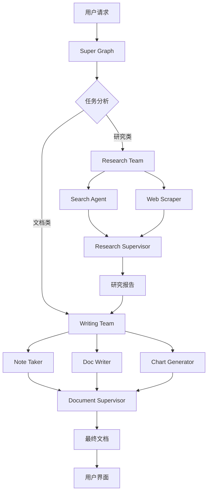

# Hierarchical Agent Teams 架构文档

## 系统概述

本系统实现了基于 LangGraph 的分层代理团队架构，采用三层级联结构实现复杂任务的智能分解和协作处理。

## 架构层次

### 第一层：Super Graph (顶级调度器)
**文件**: `backend/graph.py`

```
用户请求 → Super Supervisor → [Research Team | Writing Team] → 最终结果
```

**职责**:
- 接收用户请求，进行任务类型分析
- 智能路由到合适的团队（研究团队 → 文档团队）
- 管理团队间的数据流转
- 输出最终用户结果

### 第二层：Team Graphs (专业团队)

#### Research Team (`backend/research_teams/`)
**成员代理**:
- `search`: 执行网络搜索
- `web_scraper`: 网页内容抓取

**工作流程**:
```
Research Supervisor → search → web_scraper → 综合研究报告
```

#### Document Team (`backend/document_teams/`)
**成员代理**:
- `doc_writer`: 文档撰写和编辑
- `note_taker`: 大纲创建和笔记整理
- `chart_generator`: 数据可视化和图表生成

**工作流程**:
```
Document Supervisor → [note_taker | doc_writer | chart_generator] → 最终文档
```

### 第三层：Individual Agents (专业代理)
**基础架构**: `backend/utils/react_agent_factory.py`

每个代理都是基于 ReAct 模式的工具代理，具备：
- 推理能力（Reasoning）
- 行动能力（Acting） 
- 观察能力（Observing）

## 服务逻辑与数据流

### 1. 请求接入层 (`backend/app.py`)

```python
# SSE 流式接口
GET /api/chat/stream?message=<用户请求>

# 处理流程
1. 初始化请求上下文 (init_request_context)
2. 创建流式回调处理器 (AsyncQueueCallbackHandler)
3. 构建带流式能力的 Super Graph
4. 执行异步调用 (streaming_graph.ainvoke)
5. 返回 SSE 流式响应
```

### 2. 上下文管理 (`backend/utils/context.py`)

```python
# 请求级别的上下文变量
current_team: ContextVar[str]     # 当前执行团队
current_node: ContextVar[str]     # 当前执行节点  
_steps: ContextVar[List[Dict]]    # 执行步骤记录
```

### 3. 输出过滤机制 (`backend/utils/callbacks.py`)

**过滤策略**:
- 只有 `team == "final"` 时才输出内容
- 抑制所有中间代理响应和路由决策
- 通过 `_suppress_runs` 集合管理被抑制的执行

### 4. 督导者模式 (`backend/utils/supervisor.py`)

**路由逻辑**:
```python
# 主督导者 (make_supervisor_node)
简单文档任务 → writing_team 直接处理
复杂研究任务 → research_team → writing_team
任务完成后 → FINISH

# 团队督导者 (make_team_supervisor_node)  
协调内部代理 → 收集结果 → 生成团队响应
```

## 关键设计模式

### 1. 命令模式 (Command Pattern)
所有节点返回 `Command` 对象，包含：
- `update`: 状态更新
- `goto`: 下一个执行节点

### 2. 流式处理 (Streaming Pattern)
```
用户请求 → AsyncQueue → SSE流 → 前端实时显示
```

### 3. 上下文隔离 (Context Isolation)
每个请求独立的上下文空间，避免并发冲突

### 4. 责任链模式 (Chain of Responsibility)
```
Super Supervisor → Team Supervisor → Individual Agents
```

## 数据流转图



## 配置与部署

### 环境变量
```bash
BAILIAN_API_KEY=<大模型API密钥>
BAILIAN_BASE_URL=<API端点>
BAILIAN_MODEL=<模型名称>
```

### 启动服务
```bash
# 后端
cd backend && uvicorn app:app --reload --port 8000

# 前端  
cd frontend && npm run dev
```

## 扩展性设计

1. **新团队添加**: 在 `backend/` 下创建新的团队目录，实现团队图构建函数
2. **新代理添加**: 在团队内添加新的代理节点和对应工具
3. **新工具集成**: 在 `*_team_tools.py` 中添加新的工具函数
4. **路由策略扩展**: 修改督导者的路由逻辑支持新的任务类型

系统采用松耦合设计，各层级相对独立，便于功能扩展和维护。